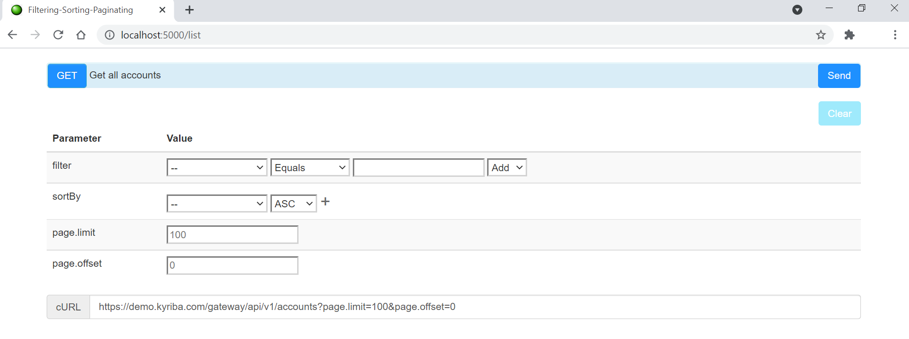

# dev-portal-Filtering-Sorting-Paginating-sample


## Requirements

Building the API client library requires:
1. Java 1.8 or higher [Installation][1]
2. Gradle [Installation][2]

[1]: https://www.oracle.com/java/technologies/javase-downloads.html 
[2]: https://gradle.org/install/

> ⚠️  _If you also have JRE installed, create a new environment variable for Java and set a new path for the PATH environment to the JDK folder in "Program Files". Guides for creating and setting a new path: [Windows][3] / [Unix][4] / [MacOS][5]._
> 
 [3]: https://stackoverflow.com/a/35623142
 [4]: https://linuxize.com/post/how-to-set-and-list-environment-variables-in-linux/?__cf_chl_managed_tk__=2d828b14fa177654a647a55ddfd6c806684ba724-1623071966-0-AQljDh9QvmnbGDiK9JEyOIzDsAnC1zFP3J8sHt1Rq5PuJ6vmiibCZCiYTQF1w-VaFoGl2Xp0uOYGFGH7uaNxWbX-S7qW84E3xKzPpdm2g1alzFj3X-mlJGemcio1_AcmIw1T1P_SjgjqhTWCRjTV6-aw39KSFnFtNmcori6DHk9fiRCPHFJWiqJ8bE5Ps4Z0BW0SLQ0M08ZI_-zne14-sqX6I0VyKLPh_43Y8U_KQPgVpSHvPyh2hhPmEWmrymHEzTb9fC2qNwtHXI81nbqj2s8BiilvJ-NAhFB7dQ4_nwY7hCOda0XP6fSicXuBHKrJChBE4ynd_7Kk1BJizfvB0zAx5OCxKPGJTJCiLHKj4Ompnrxb229jpGc6p4JfBd9Oz-J-7HAN81SAQxyONgSGp5fYGSGzedoL5jOgioCIoQvTq0ce3hFDGpBaz1ShHym71eixeNjJAk2m7cNHVwSfhqM-jAUPRFANj_QLIzuwkxy_pdb3kZ5mH1GzKT0gXH_rfMSctm8-PkHn0Yzgjr3ne8I9de0df7-8EOA53Qw5Zq0Ed6Yw-evxD7TJuFKspdjUe6ZdbdsmrjHgPZl7WBaNKGhNDpHZxWRA_R5TDqH57oqtngzMW8IsEwQSXmIZToWCoU4SM15_D2SL_SNU2OAwslmmg0-8z8fMQ9nC4MvIDB_RAubUFonkPL60VTu10xg4XmahsxBbF8SNKe_INR0bLBOLZmVA0ijhD_h1-UusutbdarDHKuxaursdW6Jb8gcn3A
 [5]: https://apple.stackexchange.com/a/229941

## Installation

To copy the API client to your computer copy link of the repository, open Command Prompt, go to the location where project will be copied and execute git clone command:

```shell
git clone https://github.com/kyriba/dev-portal-Filtering-Sorting-Paginating-sample.git
```

Open the project folder via command prompt, for example:
```shell
cd dev-portal-Filtering-Sorting-Paginating-sample
```

> ⚠️  _Before building project go to .../src/main/resources/application.yml and update client_id and client_secret with your credentials._

Build project:
```shell
gradle clean build
```

And execute jar file: 

```shell
java -jar "build/libs/filtering-sorting-pagination-1.0.0.jar"
```
> ⚠️  _Please notice that the path to your local directory is provided in MacOS/Unix format. Windows is slash-sensitive, so if you are using a Windows system, replace "/" with "\\"._

Choose the API from the provided list in the Terminal, by typing the number of the item on the list or by providing the name of the API. Name are case-sensitive, make sure you write them in lower-case and not introduce any additional characters.


Go to the link:

```shell
http://localhost:5000/list
```
> ⚠️  _To change the port, go to .../src/main/resources/application.yml and replace the "port" value._


If everything was done accordingly with provided steps, the result should look as presented in the image below:




To terminate application press Ctrl + C and execute Y.

Note that new APIs, filters and values for them can be added to the application.yml file.

> ⚠️  _If application.yml was modified after application had been built, it needs to be rebuilt. In that case, execute gradle clean build again._  


